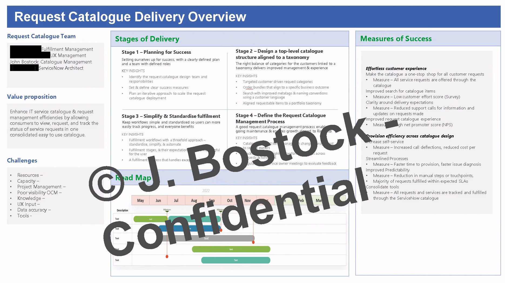

# JB Portfolio.github.io
# IT Manager | Service Delivery Manager

### Summary
With over 20 years in IT leadership, primarily in the global mining sector, my career encompasses significant roles at Rio Tinto, Cleveland
Cliffs, and First Quantum Minerals. I have a strong track record and a service thinking approach in integrating IT service management with
broader business strategies, which has supported consistent and reliable mining operations, directly contributing to both growth and
operational efficiency. I'm experienced in overseeing digital initiatives as part of larger operational goals, I am adept in IT planning, 
stakeholder engagement, and implementing effective technology solutions within pressured timelines. 

My approach is pragmatic and results-driven,focusing on enhancing service delivery to ensure technology effectively supports and advances 
agreed business objectives. While innovation has been part of my role, my primary focus is on practical application and results. I leverage 
my technical knowledge and leadership skills to drive improvements and maintain a team environment that is adaptable and responsive to evolving business needs.

[LinkedIn Profile](https://www.linkedin.com/in/bostockj)

### About My Portfolio: A Journey of IT Service Excellence
Welcome to my GitHub portfolio! I've created this space to showcase the range of projects and initiatives I've led or contributed to. This portfolio reflects my commitment to driving technological and service excellence, detailing real world problems, innovative solutions, and the impactful results achieved. It serves as a testament to my continual learning journey and my dedication to enhancing business operations through effective IT strategies. Whether you're a potential employer, a fellow IT professional, or an interested observer, I invite you to explore the work I've done and the value I've added to each project.

### Project Presentation Approach & Confidentiality
 I have structured my project overviews using the Situation, Problem, Action, and Result (SPAR) framework, ensuring clarity and conciseness in presenting my work. Please note that any sensitive information has been appropriately redacted or omitted for confidentiality.

## Table of Contents
- [Project 1: ServiceNow Catalogue Optimization](#project-1-service-request-catalogue-optimisation)
- [Project 2: Second Project Title](#project-2-second-project-title)
- [Project 3: Third Project Title](#project-3-third-project-title)
- [Project 4: Fourth Project Title](#project-4-fourth-project-title)
- [Project 5: Fifth Project Title](#project-5-fifth-project-title)

### Project 1: Service Request Catalogue Optimisation
<h3 style="color:blue">Summary</h3>
The Request Catalogue Optimisation Project aimed to address the request form inefficiencies and outdated request management process of our existing service request catalogue within ServiceNow. Our mission was to revitalise the user experience by streamlining, modernising, and redesigning the forms within the new ServiceNow platform. By enhancing the look and feel of the request forms and improving the fulfillment process, we sought to reduce lead times and establish a strong foundation for the request catalogues future. The project's success was measured by its contribution to a more agile and responsive service management environment, reflecting our commitment to continuous improvement and excellence in IT service delivery.

### Situation
Our legacy ServiceNow platform, containing over 800 service request forms, had become bloated and inefficient due to over-customisation and lack of governance, leading to cumbersome request management processes and extended lead times. The need for a complete overhaul was evident as we prepared to transition away from the outdated and old ServiceNow system. The initial phase focused on baselining the existing setup and targeting the top 100 forms for immediate attention and redesign. This phase was essential in managing the scope effectively, meeting tight deadlines, and ensuring a smooth transition to a more streamlined and effective service request process in the new ServiceNow environment.

By distinguishing the sections this way, the "Summary" provides an overview of the project's purpose and the broad outcomes, while the "Situation" offers more detail on the starting point and specific challenges that needed to be addressed. This ensures that each part has its unique focus and avoids repetition.

### Project 2: Second Project Title
Content for project 2...

### Project 3: Third Project Title
Content for project 3...

### Project 4: Fourth Project Title
Content for project 4...

### Project 5: Fifth Project Title
Content for project 5...

- Test text
- - Test text

### Projects2
Something Solid 5
- Test text
- - Test text
